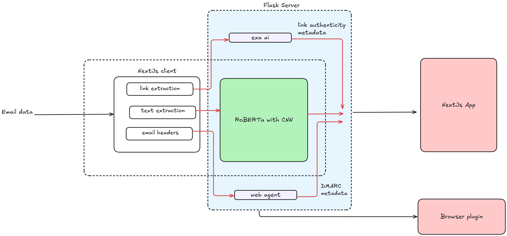

<h3 align="center">✨ TruthSeek: Transformer based email spam classifier</h3>

  
  
  
  
  

## Table of Contents
- [Introduction](#introduction)
- [Contributors](#contributors)
- [Analytics](#analytics)

## Introduction

TruthSeek is an advanced email classifier that leverages a multi-stage architecture combining RoBERTa with CNN and a hierarchical attention network. This approach ensures high accuracy in distinguishing spam from legitimate emails. It is a multi-modal system that takes into consideration email protocols like DMARC, SPF, and DKIM. Additionally, it uses web agents to verify the authenticity of email senders, enhancing the reliability of the classification process.

### Model Architecture
1. **RoBERTa**: Utilized for initial text encoding.
2. **CNN**: Applied for feature extraction from encoded text.
3. **BiLSTM**: Used for sentence-level embedding to capture context from both directions.
4. **Hierarchical Attention Network**: Enhances the model's focus on important words and sentences.

  

### Model Links

- [RoBERTa Model on HuggingFace](https://huggingface.co/annalhq/truthseek)

## Contributors

## Analytics
